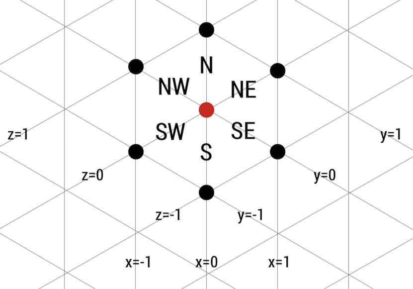

@import "../css/aoc.less"

# Day 11 (2017): Hex Ed

'Part One' and 'Part Two' puzzle descriptions and puzzle input from [Advent of Code](https://adventofcode.com/2017/day/11):

{( part1|}

Crossing the bridge, you've barely reached the other side of the stream when a program comes up to you, clearly in distress. "It's my child process," she says, "he's gotten lost in an infinite grid!"

Fortunately for her, you have plenty of experience with infinite grids.

Unfortunately for you, it's a hex grid.

The hexagons ("hexes") in this grid are aligned such that adjacent hexes can be found to the north, northeast, southeast, south, southwest, and northwest:

      \ n  /
    nw +--+ ne
      /    \
    -+      +-
      \    /
    sw +--+ se
      / s  \

You have the path the child process took. Starting where he started, you need to **determine the fewest number of steps required to reach him**. (A "step" means to move from the hex you are in to any adjacent hex.)

For example:

- ne,ne,ne is 3 steps away.
- ne,ne,sw,sw is 0 steps away (back where you started).
- ne,ne,s,s is 2 steps away (se,se).
- se,sw,se,sw,sw is 3 steps away (s,s,sw).

{| part1 )}

## Approach

A convenient way to represent a position on a hex grid is as a position along three axes at 120 degrees to one another. While there is some redundancy here, it does make working with the positions a little simpler.

```elm {l}
type alias Position =
    ( Int, Int, Int )
```

This allows us to create some simple vector displacements and measurements:

```elm {l}
move : Position -> Position -> Position
move ( x0, y0, z0 ) ( x1, y1, z1 ) =
    ( x0 + x1, y0 + y1, z0 + z1 )


distFromOrigin : Position -> Int
distFromOrigin ( x, y, z ) =
    (abs x + abs y + abs z) // 2


toVect : String -> Position
toVect instr =
    case instr of
        "n" ->
            ( 0, 1, 1 )

        "ne" ->
            ( 1, 1, 0 )

        "se" ->
            ( 1, 0, -1 )

        "s" ->
            ( 0, -1, -1 )

        "sw" ->
            ( -1, -1, 0 )

        "nw" ->
            ( -1, 0, 1 )

        _ ->
            ( 0, 0, 0 ) |> Debug.log "Unknown instruction"
```

We then just displace the position by the vector determined by the movement instruction ("n", "ne" etc.)

```elm {l r}
part1 : Int
part1 =
    puzzleInput
        |> List.map toVect
        |> List.foldl move ( 0, 0, 0 )
        |> distFromOrigin
```

{( part2 |}

How many steps away is the furthest he ever got from his starting position?

{| part2 )}

## Approach

The only modification we need for part 2 is to keep track of the intermediate locations (with `scanl`) and find the one with the maximum distance fro the origin:

```elm {l r}
part2 : Int
part2 =
    puzzleInput
        |> List.map toVect
        >> scanl move ( 0, 0, 0 )
        >> List.map distFromOrigin
        >> List.maximum
        >> Maybe.withDefault 0
```

## Reflection

This was probably one of the easiest puzzles of the month. The only "trick" was to avoid getting too distracted by the hex grid - no need for trigonometrical calculations if three axes are used.


