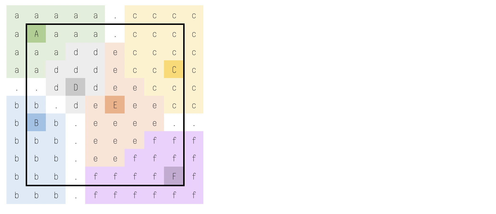

@import "../css/aoc.less"

# Day 6 (2018): Chronal Coordinates

'Part One' and 'Part Two' puzzle descriptions and puzzle input from [Advent of Code](https://adventofcode.com/2018/day/6):

{( part1|}

The device on your wrist beeps several times, and once again you feel like you're falling.

"Situation critical," the device announces. "Destination indeterminate. Chronal interference detected. Please specify new target coordinates."

The device then produces a list of coordinates (your puzzle input). Are they places it thinks are safe or dangerous? It recommends you check manual page 729. The Elves did not give you a manual.

If they're dangerous, maybe you can minimize the danger by finding the coordinate that gives the largest distance from the other points.

Using only the Manhattan distance, determine the area around each coordinate by counting the number of integer X,Y locations that are closest to that coordinate (and aren't tied in distance to any other coordinate).

Your goal is to find the size of the largest area that isn't infinite. For example, consider the following list of coordinates:

    1, 1
    1, 6
    8, 3
    3, 4
    5, 5
    8, 9

If we name these coordinates A through F, we can draw them on a grid, putting 0,0 at the top left:

    ..........
    .A........
    ..........
    ........C.
    ...D......
    .....E....
    .B........
    ..........
    ..........
    ........F.

This view is partial - the actual grid extends infinitely in all directions. Using the Manhattan distance, each location's closest coordinate can be determined, shown here in lowercase:

    aaaaa.cccc
    aAaaa.cccc
    aaaddecccc
    aadddeccCc
    ..dDdeeccc
    bb.deEeecc
    bBb.eeee..
    bbb.eeefff
    bbb.eeffff
    bbb.ffffFf

Locations shown as . are equally far from two or more coordinates, and so they don't count as being closest to any.

In this example, the areas of coordinates A, B, C, and F are infinite - while not shown here, their areas extend forever outside the visible grid. However, the areas of coordinates D and E are finite: D is closest to 9 locations, and E is closest to 17 (both including the coordinate's location itself). Therefore, in this example, the size of the largest area is 17.

**What is the size of the largest area that isn't infinite?**

{| part1 )}

## Parsing and Data Structures

For convenience and clarity, we can store each point location in its own record.

```elm {l}
type alias Point =
    { x : Int
    , y : Int
    }


parse : List String -> List Point
parse =
    let
        parseLine line =
            case String.split ", " line of
                [ x, y ] ->
                    Just (Point (toInt x) (toInt y))

                _ ->
                    Nothing
    in
    List.map parseLine >> List.filterMap identity
```

Because the locations are placed on an integer-rounded grid using Manhatten distances, it makes sense to represent the space as a grid, which we can represent with the grid functions of [aoc.md](aoc.md).

## Approach

The problem requires us to construct a [Voronoi diagram](https://en.wikipedia.org/wiki/Voronoi_diagram) from the input locations.
We will only consider bounded (finite) regions of the diagram.
Unlike a Voronoi diagram using Euclidean distances, the bounded regions never extend to the minimum bounding rectangle (MBR) of the input points, illustrated here using the example from the question:



This MBR gives us the grid dimensions we can use to solve the puzzle.
We adjust the input point coordinates to fit in this MBR:

```elm {l}
points : List Point
points =
    let
        minX =
            parse puzzleInput |> List.map .x |> List.minimum |> Maybe.withDefault 0

        minY =
            parse puzzleInput |> List.map .y |> List.minimum |> Maybe.withDefault 0

        moveToOrigin p =
            { p | x = p.x - minX, y = p.y - minY }
    in
    parse puzzleInput |> List.map moveToOrigin


numGridRows : Int
numGridRows =
    List.foldl (\p my -> max my p.y) 0 points |> (+) 1


numGridCols : Int
numGridCols =
    List.foldl (\p mx -> max mx p.x) 0 points |> (+) 1
```

In order to identify whether any given location has more than one nearest neighbour, we will need to be able to encode each location with the point ID of its neighbour. Rather than store this explicitly (a-f in the question example), we can calculate a 'location hash' based on a point's coordinates and the grid width:

```elm {l}
pointID : Point -> Int
pointID p =
    p.y * numGridCols + p.x
```

To build the Voronoi regions, we have to find the location hash of the nearest point to any given grid cell.
If there is more than one such point, it is invalidated with a negative hash:

```elm {l}
nearest : List Point -> ( Int, Int ) -> Int
nearest ps ( x, y ) =
    let
        distanceTo p =
            abs (x - p.x) + abs (y - p.y)

        minDist p ( pID, dMin ) =
            if distanceTo p == dMin then
                ( -1, dMin )

            else if distanceTo p < dMin then
                ( pointID p, distanceTo p )

            else
                ( pID, dMin )
    in
    List.foldl minDist ( 0, 99999 ) ps
        |> Tuple.first
```

We can now solve by generating the grid containing positive IDs for non-equidistant cells and invalidating IDs of regions that reach the edge cells. The frequency of the commonest valid ID gives us our answer.

```elm {l r}
part1 : Int
part1 =
    let
        dGrid =
            gMapWithLocation (\coord _ -> nearest points coord) (gInit numGridRows numGridCols -1)

        edgeIDs =
            (gGetRow 0 dGrid |> Maybe.withDefault [])
                ++ (gGetRow (numGridRows - 1) dGrid |> Maybe.withDefault [])
                ++ (gGetCol 0 dGrid |> Maybe.withDefault [])
                ++ (gGetCol (numGridCols - 1) dGrid |> Maybe.withDefault [])
                |> unique

        interiors =
            dGrid
                |> gToList
                |> List.filter (\x -> x /= -1 && not (List.member x edgeIDs))
    in
    modeCount interiors |> Maybe.withDefault -1
```

{( part2 |}

On the other hand, if the coordinates are safe, maybe the best you can do is try to find a region near as many coordinates as possible.

For example, suppose you want the sum of the Manhattan distance to all of the coordinates to be less than 32. For each location, add up the distances to all of the given coordinates; if the total of those distances is less than 32, that location is within the desired region. Using the same coordinates as above, the resulting region looks like this:

    ..........
    .A........
    ..........
    ...###..C.
    ..#D###...
    ..###E#...
    .B.###....
    ..........
    ..........
    ........F.

In particular, consider the location 4,3 located at the top middle of the region. Its calculation is as follows, where abs() is the absolute value function:

- Distance to coordinate A: abs(4-1) + abs(3-1) = 5
- Distance to coordinate B: abs(4-1) + abs(3-6) = 6
- Distance to coordinate C: abs(4-8) + abs(3-3) = 4
- Distance to coordinate D: abs(4-3) + abs(3-4) = 2
- Distance to coordinate E: abs(4-5) + abs(3-5) = 3
- Distance to coordinate F: abs(4-8) + abs(3-9) = 10
- Total distance: 5 + 6 + 4 + 2 + 3 + 10 = 30

Because the total distance to all coordinates (30) is less than 32, the location is within the region.

This region, which also includes coordinates D and E, has a total size of **16**.

Your actual region will need to be much larger than this example, though, instead including all locations with a total distance of less than 10000.

What is the size of the region containing all locations which have a total distance to all given coordinates of less than 10000?

{| part2 )}

The second part is more straightforward in that we do not need to construct a grid explicitly, but instead test the neighbour distance of all locations within the MBR to see if it is within the maximum total distance of 10000:

```elm {l}
withinTotalDistance : List Point -> Int -> ( Int, Int ) -> Bool
withinTotalDistance ps maxDist ( x, y ) =
    let
        dist p =
            abs (x - p.x) + abs (y - p.y)

        minDist p ( nearestP, dMin ) =
            if dist p < dMin then
                ( p, dist p )

            else
                ( nearestP, dMin )
    in
    List.foldl ((+) << dist) 0 ps < maxDist
```

```elm {l r}
part2 : Int
part2 =
    let
        coords =
            List.range 0 (numGridRows - 1)
                |> List.concatMap (\x -> List.map (\y -> ( x, y )) (List.range 0 (numGridCols - 1)))
    in
    List.map (withinTotalDistance points 10000) coords |> List.filter identity |> List.length
```

## Reflection

The problem was immediately recognisable as relating to Voronoi diagrams and I felt "at home" with this one.
What wasn't so obvious to me, but pleasing to discover, were the extra properties of a Voronoi diagram using a Manhattan metric.
In particular that interior bounded regions are so easily computable (it is much messier with Euclidean distances).

Compared to some of the previous puzzles, I made fewer mistakes so the process of solving it was more satisfying.
I managed to get the answers relatively quickly (for me), but did spend a lot of time subsequently cleaning up code, refactoring and moving more common operations to [aoc.md](../aoc.md).
