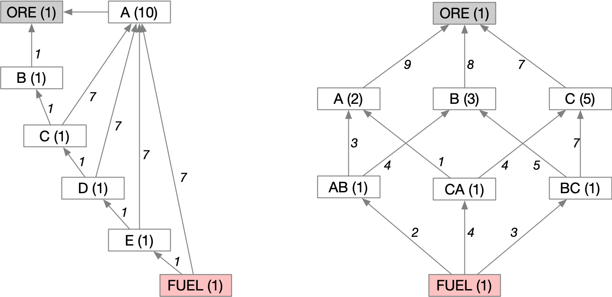

@import "../css/aoc.less"

# Day 14 (2019): Space Stoichiometry

'Part One' and 'Part Two' puzzle descriptions and puzzle input from [Advent of Code](https://adventofcode.com/2019/day/14):

{( part1|}

As you approach the rings of Saturn, your ship's **low fuel** indicator turns on. There isn't any fuel here, but the rings have plenty of raw material. Perhaps your ship's Inter-Stellar Refinery Union brand **nanofactory** can turn these raw materials into fuel.

You ask the nanofactory to produce a list of the **reactions** it can perform that are relevant to this process (your puzzle input). Every reaction turns some quantities of specific **input chemicals** into some quantity of an **output chemical**. Almost every **chemical** is produced by exactly one reaction; the only exception, ORE, is the raw material input to the entire process and is not produced by a reaction.

You just need to know how much **ORE** you'll need to collect before you can produce one unit of FUEL.

Each reaction gives specific quantities for its inputs and output; reactions cannot be partially run, so only whole integer multiples of these quantities can be used. (It's okay to have leftover chemicals when you're done, though.) For example, the reaction 1 A, 2 B, 3 C => 2 D means that exactly 2 units of chemical D can be produced by consuming exactly 1 A, 2 B and 3 C. You can run the full reaction as many times as necessary; for example, you could produce 10 D by consuming 5 A, 10 B, and 15 C.

Suppose your nanofactory produces the following list of reactions:

    10 ORE => 10 A
    1 ORE => 1 B
    7 A, 1 B => 1 C
    7 A, 1 C => 1 D
    7 A, 1 D => 1 E
    7 A, 1 E => 1 FUEL

The first two reactions use only ORE as inputs; they indicate that you can produce as much of chemical A as you want (in increments of 10 units, each 10 costing 10 ORE) and as much of chemical B as you want (each costing 1 ORE). To produce 1 FUEL, a total of **31** ORE is required: 1 ORE to produce 1 B, then 30 more ORE to produce the 7 + 7 + 7 + 7 = 28 A (with 2 extra A wasted) required in the reactions to convert the B into C, C into D, D into E, and finally E into FUEL. (30 A is produced because its reaction requires that it is created in increments of 10.)

Or, suppose you have the following list of reactions:

    9 ORE => 2 A
    8 ORE => 3 B
    7 ORE => 5 C
    3 A, 4 B => 1 AB
    5 B, 7 C => 1 BC
    4 C, 1 A => 1 CA
    2 AB, 3 BC, 4 CA => 1 FUEL

The above list of reactions requires **165** ORE to produce 1 FUEL:

- Consume 45 ORE to produce 10 A.
- Consume 64 ORE to produce 24 B.
- Consume 56 ORE to produce 40 C.
- Consume 6 A, 8 B to produce 2 AB.
- Consume 15 B, 21 C to produce 3 BC.
- Consume 16 C, 4 A to produce 4 CA.
- Consume 2 AB, 3 BC, 4 CA to produce 1 FUEL.

Here are some larger examples:

**13312** ORE for 1 FUEL:

    157 ORE => 5 NZVS
    165 ORE => 6 DCFZ
    44 XJWVT, 5 KHKGT, 1 QDVJ, 29 NZVS, 9 GPVTF, 48 HKGWZ => 1 FUEL
    12 HKGWZ, 1 GPVTF, 8 PSHF => 9 QDVJ
    179 ORE => 7 PSHF
    177 ORE => 5 HKGWZ
    7 DCFZ, 7 PSHF => 2 XJWVT
    165 ORE => 2 GPVTF
    3 DCFZ, 7 NZVS, 5 HKGWZ, 10 PSHF => 8 KHKGT

**180697** ORE for 1 FUEL:

    2 VPVL, 7 FWMGM, 2 CXFTF, 11 MNCFX => 1 STKFG
    17 NVRVD, 3 JNWZP => 8 VPVL
    53 STKFG, 6 MNCFX, 46 VJHF, 81 HVMC, 68 CXFTF, 25 GNMV => 1 FUEL
    22 VJHF, 37 MNCFX => 5 FWMGM
    139 ORE => 4 NVRVD
    144 ORE => 7 JNWZP
    5 MNCFX, 7 RFSQX, 2 FWMGM, 2 VPVL, 19 CXFTF => 3 HVMC
    5 VJHF, 7 MNCFX, 9 VPVL, 37 CXFTF => 6 GNMV
    145 ORE => 6 MNCFX
    1 NVRVD => 8 CXFTF
    1 VJHF, 6 MNCFX => 4 RFSQX
    176 ORE => 6 VJHF

**2210736** ORE for 1 FUEL:

    171 ORE => 8 CNZTR
    7 ZLQW, 3 BMBT, 9 XCVML, 26 XMNCP, 1 WPTQ, 2 MZWV, 1 RJRHP => 4 PLWSL
    114 ORE => 4 BHXH
    14 VRPVC => 6 BMBT
    6 BHXH, 18 KTJDG, 12 WPTQ, 7 PLWSL, 31 FHTLT, 37 ZDVW => 1 FUEL
    6 WPTQ, 2 BMBT, 8 ZLQW, 18 KTJDG, 1 XMNCP, 6 MZWV, 1 RJRHP => 6 FHTLT
    15 XDBXC, 2 LTCX, 1 VRPVC => 6 ZLQW
    13 WPTQ, 10 LTCX, 3 RJRHP, 14 XMNCP, 2 MZWV, 1 ZLQW => 1 ZDVW
    5 BMBT => 4 WPTQ
    189 ORE => 9 KTJDG
    1 MZWV, 17 XDBXC, 3 XCVML => 2 XMNCP
    12 VRPVC, 27 CNZTR => 2 XDBXC
    15 KTJDG, 12 BHXH => 5 XCVML
    3 BHXH, 2 VRPVC => 7 MZWV
    121 ORE => 7 VRPVC
    7 XCVML => 6 RJRHP
    5 BHXH, 4 VRPVC => 5 LTCX

Given the list of reactions in your puzzle input, **what is the minimum amount of ORE required to produce exactly 1 FUEL?**

{| part1 )}

## Parsing

We can convert the input text into a graph where each node is identified by its ingredient with additional data on its batch size, and each edge connects an ingredient with one that is needed to create it along with the volume of that ingredient required.

```elm {l}
type alias Ingredient =
    String


type alias ProductionGraph =
    -- NodeId, NodeData, EdgeData
    Graph Ingredient Int Int
```

Here are the first two examples from the question:



```elm {l}
parse : List String -> ProductionGraph
parse lines =
    let
        toPairs ps ingredients =
            case ingredients of
                [] ->
                    let
                        inp =
                            List.drop 1 ps |> List.reverse

                        outp =
                            List.head ps |> Maybe.withDefault ( 0, "" )
                    in
                    List.map (\i -> ( i, outp )) inp

                quant :: chem :: others ->
                    toPairs (( AOC.toInt quant, chem ) :: ps) others

                _ ->
                    [] |> Debug.log "Bad input"

        pairs =
            lines
                |> List.concatMap
                    (AOC.submatches "(\\d+) (\\w+)" >> List.filterMap identity >> toPairs [])

        nodes =
            List.foldl
                (\( _, ( batchSize, ing ) ) g ->
                    Graph.insertData ing batchSize g
                )
                (Graph.empty |> Graph.insertData "ORE" 1)
                pairs
    in
    List.foldl
        (\( ( vol, iIng ), ( _, oIng ) ) g ->
            Graph.insertEdgeData oIng iIng vol g
        )
        nodes
        pairs
```

## Approach

To find the total volume of ORE required we can traverse the graph from FUEL back to ORE in topological order, accumulating the quantities of required input chemicals as we go. Because we process ingredients in topological order we don't need to keep track of any excesses (we guarantee that any excess produced in a reaction will not be needed for later reactions).

```elm {l}
buildRequirements : List Ingredient -> ProductionGraph -> Dict Ingredient Int -> Dict Ingredient Int
buildRequirements sortedIngredients g requirements =
    case sortedIngredients of
        outC :: tl ->
            let
                required =
                    Dict.get outC requirements |> Maybe.withDefault 0 |> toFloat

                produced =
                    Graph.getData outC g |> Maybe.withDefault 0 |> toFloat

                n =
                    ceiling (required / produced)
            in
            -- Update required chemical volumes for any inputs to this reaction
            Graph.outgoing outC g
                |> Set.map (\inC -> ( inC, Graph.getEdgeData outC inC g |> Maybe.withDefault 0 ))
                |> Set.foldl (\( c, vol ) req -> AOC.addNToFreqTable c (vol * n) req) requirements
                |> buildRequirements tl g

        _ ->
            requirements
```

Now we have the required volumes of all chemicals, we simply extract the required volume of ORE.

```elm {l}
minOre : List Ingredient -> ProductionGraph -> Int -> Int
minOre sorted g fuel =
    buildRequirements sorted g (Dict.singleton "FUEL" fuel)
        |> Dict.get "ORE"
        |> Maybe.withDefault 0
```

```elm {l r}
part1 : Int
part1 =
    let
        g =
            parse puzzleInput

        sorted =
            g |> Graph.topologicalSort |> Maybe.withDefault []
    in
    minOre sorted g 1
```

{( part2 |}

After collecting ORE for a while, you check your cargo hold: **1 trillion (1000000000000)** units of ORE.

**With that much ore**, given the examples above:

- The 13312 ORE-per-FUEL example could produce 82892753 FUEL.
- The 180697 ORE-per-FUEL example could produce 5586022 FUEL.
- The 2210736 ORE-per-FUEL example could produce 460664 FUEL.

Given 1 trillion ORE, **what is the maximum amount of FUEL you can produce**?

{| part2 )}

## Approach Part Two

If we know $n$ ORE produces 1 FUEL, we might initially assume a trillion ORE would produce $1000000000000/n$ FUEL. However this will be an under-estimate because we generate excess ingredients in each reaction. Those excesses will, with sufficient numbers of reactions, be sufficient to generate some extra fuel. This value therefore gives us the lower bound of the correct answer. For the upper bound we can use double the lower bound, which appears sufficient for all test cases and the puzzle input.

Part 1 already gives us a way of finding the volume of ORE required for any given volume of FUEL, so we have the basis for a binary search for the correct answer, narrowing upper and lower bounds and estimating the midpoint $m$ between them on each iteration.

```elm {l}
fuelEstimate : List Ingredient -> ProductionGraph -> Int -> Int -> Int -> Int
fuelEstimate sorted g lBound uBound m =
    if lBound == uBound then
        uBound - 1

    else
        let
            ore =
                minOre sorted g m
        in
        if ore < 1000000000000 then
            fuelEstimate sorted g (m + 1) uBound (m + 1 + (uBound - m) // 2)

        else if ore > 1000000000000 then
            fuelEstimate sorted g lBound (m - 1) (lBound + (m - lBound) // 2)

        else
            m
```

```elm {l r}
part2 : Int
part2 =
    let
        g =
            parse puzzleInput

        sorted =
            g |> Graph.topologicalSort |> Maybe.withDefault []

        lBound =
            1000000000000 // minOre sorted g 1
    in
    fuelEstimate sorted g lBound (2 * lBound) (round (1.5 * toFloat lBound))
```

---

## Reflection

This one defeated me in December so I put it on hold until later in the year when I had more time and fresh eyes.

My initial solution involved keeping track of excess chemicals produced and adding them back in to inputs when needed. The key insight came when I realised that if you process the reactions in topological order, you can eliminate dependencies on future calculations, so no need to store excesses. This works because there are no cycles in the graph.

Part two was easier than part 1 as most of the work had been done (building and navigating the graph). The trillion suggested a brute force approach would not be practical, but a simple binary search meant the result was found quickly (20 iterations with my puzzle input).
