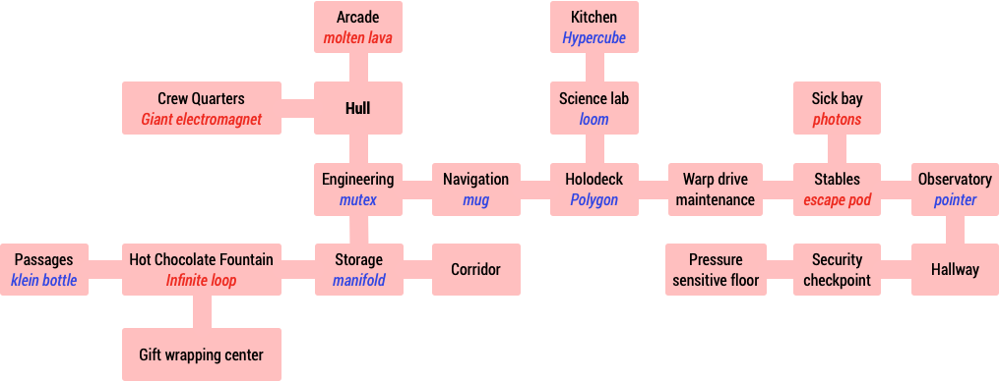

@import "../css/aoc.less"

# Day 25 (2019): Cryostasis

'Part One' puzzle description and puzzle input from [Advent of Code](https://adventofcode.com/2019/day/25):

{( part1|}

As you approach Santa's ship, your sensors report two important details:

First, that you might be too late: the internal temperature is -40 degrees.

Second, that one faint life signature is somewhere on the ship.

The airlock door is locked with a code; your best option is to send in a small droid to investigate the situation. You attach your ship to Santa's, break a small hole in the hull, and let the droid run in before you seal it up again. Before your ship starts freezing, you detach your ship and set it to automatically stay within range of Santa's ship.

This droid can follow basic instructions and report on its surroundings; you can communicate with it through an Intcode program (your puzzle input) running on an ASCII-capable computer.

As the droid moves through its environment, it will describe what it encounters. When it says Command?, you can give it a single instruction terminated with a newline (ASCII code 10). Possible instructions are:

- **Movement** via north, south, east, or west.
- To **take** an item the droid sees in the environment, use the command take <name of item>. For example, if the droid reports seeing a red ball, you can pick it up with take red ball.
- To **drop** an item the droid is carrying, use the command drop <name of item>. For example, if the droid is carrying a green ball, you can drop it with drop green ball.
- To get a **list of all of the items** the droid is currently carrying, use the command inv (for "inventory").

Extra spaces or other characters aren't allowed - instructions must be provided precisely.

Santa's ship is a **Reindeer-class starship**; these ships use pressure-sensitive floors to determine the identity of droids and crew members. The standard configuration for these starships is for all droids to weigh exactly the same amount to make them easier to detect. If you need to get past such a sensor, you might be able to reach the correct weight by carrying items from the environment.

Look around the ship and see if you can find the **password for the main airlock**.

{| part1 )}

## Parsing

To enable ASCII communication with the droid, we need to convert ASCII into intcode and intcode back to ASCII:

```elm {l}
toAscii : String -> List Int
toAscii =
    String.toList
        >> List.map Char.toCode
        >> List.reverse
        >> (::) 10


fromAscii : List Int -> String
fromAscii =
    List.map Char.fromCode
        >> String.fromList
```

## Approach

We can initialise the droid as any other intcode program:

```elm {l}
droid : Computer
droid =
    puzzleInput
        |> initComputer []
        |> runProg
```

Each round of communicating with the droid involves sending ASCII instructions and receiving the ASCII output:

```elm {l}
tick : String -> ( String, Computer ) -> ( String, Computer )
tick cmd ( _, comp ) =
    let
        droid_ =
            comp
                |> addInputs (toAscii cmd)
                |> runProg
    in
    ( droid_.outputStore |> fromAscii, clearOutput droid_ )
```

Some interactive exploration yields a map of the spaceship within which we can pick up 8 items (marked in blue), while avoiding picking up others (marked in red).



We then move to the security zone and try dropping various combinations of objects until we are let through:

```elm {l m}
part1 : List String
part1 =
    let
        pickupAll =
            [ "south"
            , "take mutex"
            , "south"
            , "take manifold"
            , "west"
            , "west"
            , "take klein bottle"
            , "east"
            , "east"
            , "north"
            , "east"
            , "take mug"
            , "east"
            , "take polygon"
            , "north"
            , "take loom"
            , "north"
            , "take hypercube"
            , "south"
            , "south"
            , "east"
            , "east"
            , "east"
            , "take pointer"
            , "south"
            , "west"
            ]

        combos =
            [ "klein bottle"
            , "loom"
            , "mutex"
            , "pointer"
            , "polygon"
            , "hypercube"
            , "mug"
            , "manifold"
            ]
                |> List.map ((++) "drop ")
                |> combinations 4
                |> List.map (flip (++) [ "west" ])

        tryItems dropCmds =
            List.foldl tick ( "", droid ) (pickupAll ++ dropCmds) |> Tuple.first
    in
    List.map tryItems combos
        |> List.filter (not << String.contains "ejected")
```

## Reflection

This was a fun finale to the AoC with echos of the [Synacor challenge](https://challenge.synacor.com). Nothing too challenging, but I do like the 'magic' of revealing an adventure game from a list of numbers.
