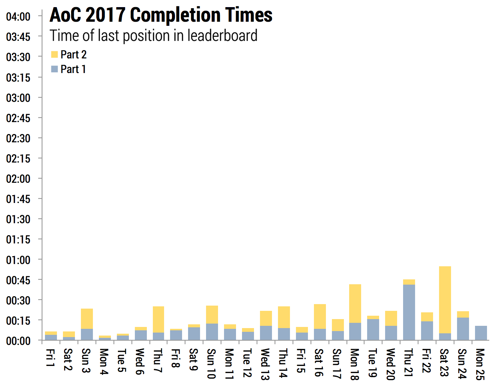
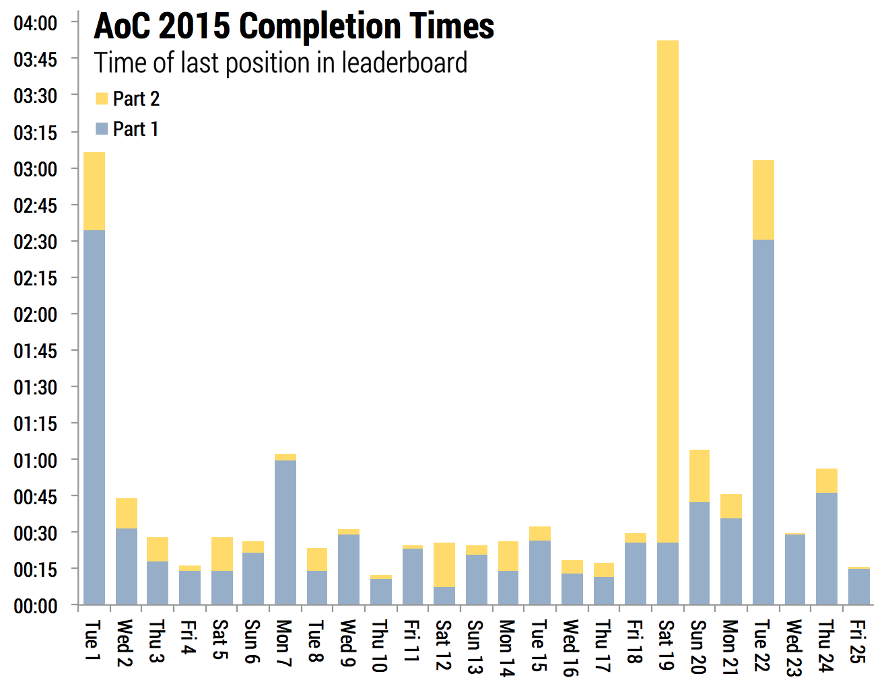

@import "./css/aoc.less"

# Literate Elm Solutions

Solutions to the [Advent of Code](http://adventofcode.com) programming challenges using _literate Elm_.
These are created in the [litvis environment](https://github.com/gicentre/litvis) and although viewable as normal markdown, to compute the answers and format output, they are best viewed in Atom/VSCode with litvis installed.

| Day | 2015                                                       | 2016                                                | 2017                                                        | 2018                                                     | 2019                                                   |
| --: | :--------------------------------------------------------- | :-------------------------------------------------- | :---------------------------------------------------------- | :------------------------------------------------------- | ------------------------------------------------------ |
|   1 | [Not Quite Lisp](2015/d01_2015.md)                         | [No Time for a Taxicab](2016/d01_2016.md)           | [Inverse Captcha](2017/d01_2017.md)                         | [Chronal Calibration](2018/d01_2018.md)                  | [The Tyranny of the Rocket Equation](2019/d01_2019.md) |
|   2 | [I Was Told There Would Be No Math](2015/d02_2015.md)      | [Bathroom Security](2016/d02_2016.md)               | [Corruption Checksum](2017/d02_2017.md)                     | [Inventory Management System](2018/d02_2018.md)          | [1202 Program Alarm](2019/d02_2019.md)                 |
|   3 | [Perfectly Spherical Houses in a Vacuum](2015/d03_2015.md) | [Squares With Three Sides](2016/d03_2016.md)        | [Spiral Memory](2017/d03_2017.md)                           | [No Matter How You Slice It](2018/d03_2018.md)           | [?](2019/d03_2019.md)                                  |
|   4 | [The Ideal Stocking Stuffer](2015/d04_2015.md)             | [Security Through Obscurity](2016/d04_2016.md)      | [High-Entropy Passphrases](2017/d04_2017.md)                | [Repose Record](2018/d04_2018.md)                        | [?](2019/d04_2019.md)                                  |
|   5 | [Doesn't He Have Intern-Elves For This?](2015/d05_2015.md) | [How About a Nice Game of Chess?](2016/d05_2016.md) | [A Maze of Twisty Trampolines, All Alike](2017/d05_2017.md) | [Alchemical Reduction](2018/d05_2018.md)                 | [?](2019/d05_2019.md)                                  |
|   6 | [Probably a Fire Hazard](2015/d06_2015.md)                 | [Signals and Noise](2016/d06_2016.md)               | [Memory Reallocation](2017/d06_2017.md)                     | [Chronal Coordinates](2018/d06_2018.md)                  | [?](2019/d06_2019.md)                                  |
|   7 | [Some Assembly Required](2015/d07_2015.md)                 | [Internet Protocol Version 7](2016/d07_2016.md)     | [Recursive Circus](2017/d07_2017.md)                        | [The Sum of Its Parts](2018/d07_2018.md)                 | [?](2019/d07_2019.md)                                  |
|   8 | [Matchsticks](2015/d08_2015.md)                            | [Two-Factor Authentication](2016/d08_2016.md)       | [I Heard You Like Registers](2017/d08_2017.md)              | [Memory Maneuver](2018/d08_2018.md)                      | [?](2019/d08_2019.md)                                  |
|   9 | [All in a Single Night](2015/d09_2015.md)                  | x                                                   | [Stream Processing](2017/d09_2017.md)                       | [Marble Mania](2018/d09_2018.md)                         | [?](2019/d09_2019.md)                                  |
|  10 | [Elves Look, Elves Say](2015/d10_2015.md)                  | x                                                   | [Knot Hash](2017/d10_2017.md)                               | [The Stars Align](2018/d10_2018.md)                      | [?](2019/d10_2019.md)                                  |
|  11 | [Corporate Policy](2015/d11_2015.md)                       | x                                                   | x                                                           | [Chronal Charge](2018/d11_2018.md)                       | [?](2019/d11_2019.md)                                  |
|  12 | [JSAbacusFramework.io](2015/d12_2015.md)                   | x                                                   | x                                                           | [Subterranean Sustainability](2018/d12_2018.md)          | [?](2019/d12_2019.md)                                  |
|  13 | [Knights of the Dinner Table](2015/d13_2015.md)            | x                                                   | x                                                           | [Mine Cart Madness](2018/d13_2018.md)                    | [?](2019/d13_2019.md)                                  |
|  14 | [Reindeer Olympics](2015/d14_2015.md)                      | x                                                   | [Disk Defragmentation](2017/d14_2017.md)                    | [Chocolate Charts](2018/d14_2018.md)                     | [?](2019/d14_2019.md)                                  |
|  15 | [Science for Hungry People](2015/d15_2015.md)              | x                                                   | x                                                           | [Beverage Bandits](2018/d15_2018.md)                     | [?](2019/d15_2019.md)                                  |
|  16 | [Aunt Sue](2015/d16_2015.md)                               | x                                                   | x                                                           | [Chronal Classification](2018/d16_2018.md)               | [?](2019/d16_2019.md)                                  |
|  17 | [No Such Thing as Too Much](2015/d17_2015.md)              | x                                                   | x                                                           | [Reservoir Research](2018/d17_2018.md)                   | [?](2019/d17_2019.md)                                  |
|  18 | [Like a GIF For Your Yard](2015/d18_2015.md)               | x                                                   | x                                                           | [Settlers of The North Pole](2018/d18_2018.md)           | [?](2019/d18_2019.md)                                  |
|  19 | [Medicine for Rudolph](2015/d19_2015.md)                   | x                                                   | x                                                           | [ Go With The Flow](2018/d19_2018.md)                    | [?](2019/d19_2019.md)                                  |
|  20 | [Infinite Elves and Infinite Houses](2015/d20_2015.md)     | x                                                   | x                                                           | [ A Regular Map](2018/d20_2018.md)                       | [?](2019/d20_2019.md)                                  |
|  21 | [RPG Simulator 20XX](2015/d21_2015.md)                     | x                                                   | x                                                           | [Chronal Conversion](2018/d21_2018.md)                   | [?](2019/d21_2019.md)                                  |
|  22 | x                                                          | x                                                   | x                                                           | [Mode Maze](2018/d22_2018.md)                            | [?](2019/d22_2019.md)                                  |
|  23 | [Opening the Turing Lock](2015/d23_2015.md)                | x                                                   | x                                                           | [Experimental Emergency Teleportation](2018/d23_2018.md) | [?](2019/d23_2019.md)                                  |
|  24 | x                                                          | x                                                   | x                                                           | [Immune System Simulator 20XX](2018/d24_2018.md)         | [?](2019/d24_2019.md)                                  |
|  25 | x                                                          | x                                                   | x                                                           | [Four-Dimensional Adventure](2018/d25_2018.md)           | [?](2019/d25_2019.md)                                  |

---

## Completion Times

Puzzle difficulty as measured by time taken by the 100th person on the global leader board to complete each puzzle.

 

 
