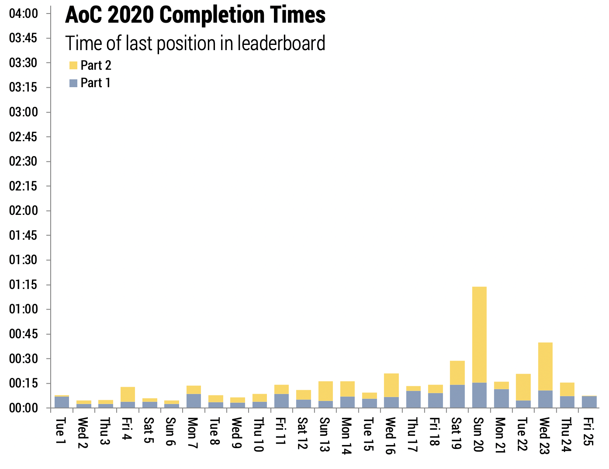

@import "./css/aoc.less"

# Advent of Code

## Literate Elm Solutions

Solutions to the [Advent of Code](http://adventofcode.com) programming challenges using _literate Elm_. These are created in the [litvis environment](https://github.com/gicentre/litvis) and although viewable as normal markdown, to compute the answers and format output, they are best viewed in Atom/VSCode with litvis installed.

| Day | 2020                                        | 2019                                                   | 2018                                                     | 2017                                                        | 2016                                                | 2015                                                       |
| --: | :------------------------------------------ | :----------------------------------------------------- | :------------------------------------------------------- | :---------------------------------------------------------- | --------------------------------------------------- | ---------------------------------------------------------- |
|   1 | [Report Repair](2020/d01_2020.md)           | [The Tyranny of the Rocket Equation](2019/d01_2019.md) | [Chronal Calibration](2018/d01_2018.md)                  | [Inverse Captcha](2017/d01_2017.md)                         | [No Time for a Taxicab](2016/d01_2016.md)           | [Not Quite Lisp](2015/d01_2015.md)                         |
|   2 | [Password Philosophy](2020/d02_2020.md)     | [1202 Program Alarm](2019/d02_2019.md)                 | [Inventory Management System](2018/d02_2018.md)          | [Corruption Checksum](2017/d02_2017.md)                     | [Bathroom Security](2016/d02_2016.md)               | [I Was Told There Would Be No Math](2015/d02_2015.md)      |
|   3 | [Toboggan Trajectory](2020/d03_2020.md)     | [Crossed Wires](2019/d03_2019.md)                      | [No Matter How You Slice It](2018/d03_2018.md)           | [Spiral Memory](2017/d03_2017.md)                           | [Squares With Three Sides](2016/d03_2016.md)        | [Perfectly Spherical Houses in a Vacuum](2015/d03_2015.md) |
|   4 | [Passport Processing](2020/d04_2020.md)     | [Secure Container](2019/d04_2019.md)                   | [Repose Record](2018/d04_2018.md)                        | [High-Entropy Passphrases](2017/d04_2017.md)                | [Security Through Obscurity](2016/d04_2016.md)      | [The Ideal Stocking Stuffer](2015/d04_2015.md)             |
|   5 | [Binary Boarding](2020/d05_2020.md)         | [Sunny with a Chance of Asteroids](2019/d05_2019.md)   | [Alchemical Reduction](2018/d05_2018.md)                 | [A Maze of Twisty Trampolines, All Alike](2017/d05_2017.md) | [How About a Nice Game of Chess?](2016/d05_2016.md) | [Doesn't He Have Intern-Elves For This?](2015/d05_2015.md) |
|   6 | [Custom Customs](2020/d06_2020.md)          | [Universal Orbit Map](2019/d06_2019.md)                | [Chronal Coordinates](2018/d06_2018.md)                  | [Memory Reallocation](2017/d06_2017.md)                     | [Signals and Noise](2016/d06_2016.md)               | [Probably a Fire Hazard](2015/d06_2015.md)                 |
|   7 | [Handy Haversacks](2020/d07_2020.md)        | [Amplification Circuit](2019/d07_2019.md)              | [The Sum of Its Parts](2018/d07_2018.md)                 | [Recursive Circus](2017/d07_2017.md)                        | [Internet Protocol Version 7](2016/d07_2016.md)     | [Some Assembly Required](2015/d07_2015.md)                 |
|   8 | [Handheld Halting](2020/d08_2020.md)        | [Space Image Format](2019/d08_2019.md)                 | [Memory Maneuver](2018/d08_2018.md)                      | [I Heard You Like Registers](2017/d08_2017.md)              | [Two-Factor Authentication](2016/d08_2016.md)       | [Matchsticks](2015/d08_2015.md)                            |
|   9 | [Encoding Error](2020/d09_2020.md)          | [Sensor Boost](2019/d09_2019.md)                       | [Marble Mania](2018/d09_2018.md)                         | [Stream Processing](2017/d09_2017.md)                       | [Explosives in Cyberspace](2016/d09_2016.md)        | [All in a Single Night](2015/d09_2015.md)                  |
|  10 | [Adapter Array](2020/d10_2020.md)           | [Monitoring Station](2019/d10_2019.md)                 | [The Stars Align](2018/d10_2018.md)                      | [Knot Hash](2017/d10_2017.md)                               | [Balance Bots](2016/d10_2016.md)                    | [Elves Look, Elves Say](2015/d10_2015.md)                  |
|  11 | [Seating System](2020/d11_2020.md)          | [Space Police](2019/d11_2019.md)                       | [Chronal Charge](2018/d11_2018.md)                       | [Hex Ed](2017/d11_2017.md)                                  | [x](2016/d11_2016.md)                               | [Corporate Policy](2015/d11_2015.md)                       |
|  12 | [Rain Risk](2020/d12_2020.md)               | [The N-Body Problem](2019/d12_2019.md)                 | [Subterranean Sustainability](2018/d12_2018.md)          | [x](2017/d12_2017.md)                                       | [x](2016/d12_2016.md)                               | [JSAbacusFramework.io](2015/d12_2015.md)                   |
|  13 | [Shuttle Search](2020/d13_2020.md)          | [Care Package](2019/d13_2019.md)                       | [Mine Cart Madness](2018/d13_2018.md)                    | [x](2017/d13_2017.md)                                       | [x](2016/d13_2016.md)                               | [Knights of the Dinner Table](2015/d13_2015.md)            |
|  14 | [Docking Data](2020/d14_2020.md)            | [Space Stoichiometry](2019/d14_2019.md)                | [Chocolate Charts](2018/d14_2018.md)                     | [Disk Defragmentation](2017/d14_2017.md)                    | [x](2016/d14_2016.md)                               | [Reindeer Olympics](2015/d14_2015.md)                      |
|  15 | [Rambunctious Recitation](2020/d15_2020.md) | [Oxygen System](2019/d15_2019.md)                      | [Beverage Bandits](2018/d15_2018.md)                     | [x](2017/d15_2017.md)                                       | [x](2016/d15_2016.md)                               | [Science for Hungry People](2015/d15_2015.md)              |
|  16 | [Ticket Translation](2020/d16_2020.md)      | [Flawed Frequency Transmission](2019/d16_2019.md)      | [Chronal Classification](2018/d16_2018.md)               | [Permutation Promenade](2017/d16_2017.md)                   | [x](2016/d16_2016.md)                               | [Aunt Sue](2015/d16_2015.md)                               |
|  17 | [Conway Cubes](2020/d17_2020.md)            | [Set and Forget](2019/d17_2019.md)                     | [Reservoir Research](2018/d17_2018.md)                   | [x](2017/d17_2017.md)                                       | [x](2016/d17_2016.md)                               | [No Such Thing as Too Much](2015/d17_2015.md)              |
|  18 | [Operation Order](2020/d18_2020.md)         | [Many-Worlds Interpretation](2019/d18_2019.md)         | [Settlers of The North Pole](2018/d18_2018.md)           | [x](2017/d18_2017.md)                                       | [x](2016/d18_2016.md)                               | [Like a GIF For Your Yard](2015/d18_2015.md)               |
|  19 | [x](2020/d19_2020.md)                       | [Tractor Beam](2019/d19_2019.md)                       | [Go With The Flow](2018/d19_2018.md)                     | [x](2017/d19_2017.md)                                       | [x](2016/d19_2016.md)                               | [Medicine for Rudolph](2015/d19_2015.md)                   |
|  20 | [Jurassic Jigsaw](2020/d20_2020.md)         | [Donut Maze](2019/d20_2019.md)                         | [A Regular Map](2018/d20_2018.md)                        | [x](2017/d20_2017.md)                                       | [x](2016/d20_2016.md)                               | [Infinite Elves and Infinite Houses](2015/d20_2015.md)     |
|  21 | [Allergen Assessment](2020/d21_2020.md)     | [Springdroid Adventure](2019/d21_2019.md)              | [Chronal Conversion](2018/d21_2018.md)                   | [x](2017/d21_2017.md)                                       | [x](2016/d21_2016.md)                               | [RPG Simulator 20XX](2015/d21_2015.md)                     |
|  22 | [Crab Combat](2020/d22_2020.md)             | [Slam Shuffle](2019/d22_2019.md)                       | [Mode Maze](2018/d22_2018.md)                            | [x](2017/d22_2017.md)                                       | [x](2016/d22_2016.md)                               | [x](2015/d22_2015.md)                                      |
|  23 | [Crab Cups](2020/d23_2020.md)               | [Category Six](2019/d23_2019.md)                       | [Experimental Emergency Teleportation](2018/d23_2018.md) | [x](2017/d23_2017.md)                                       | [x](2016/d23_2016.md)                               | [Opening the Turing Lock](2015/d23_2015.md)                |
|  24 | [Lobby Layout](2020/d24_2020.md)            | [Planet of Discord](2019/d24_2019.md)                  | [Immune System Simulator 20XX](2018/d24_2018.md)         | [x](2017/d24_2017.md)                                       | [x](2016/d24_2016.md)                               | [x](2015/d24_2015.md)                                      |
|  25 | [Combo Breaker](2020/d25_2020.md)           | [Cryostasis](2019/d25_2019.md)                         | [Four-Dimensional Adventure](2018/d25_2018.md)           | [x](2017/d25_2017.md)                                       | [x](2016/d25_2016.md)                               | [x](2015/d25_2015.md)                                      |
|     |

---

## Completion Times

Puzzle difficulty as measured by time taken by the 100th person on the global leader board to complete each puzzle.

 

 

 ˜

Frequency distributions of times for the first 1000 stars of each colour. Times, on the horizontal axis, are in seconds on a log scale. As a guide, 256s = ~4min; 2048s = ~30mins; 32768s = ~9hrs and the right hand side is ~4 days.

